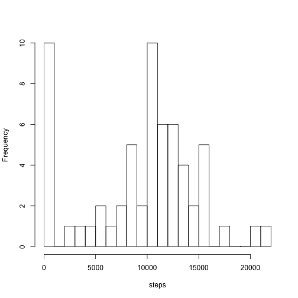

### Loading and preprocessing the data


```r
df <- read.csv('activity.csv', na.strings="NA", colClasses=c("integer", "Date", "integer"))
str(df)
```

```
## 'data.frame':	17568 obs. of  3 variables:
##  $ steps   : int  NA NA NA NA NA NA NA NA NA NA ...
##  $ date    : Date, format: "2012-10-01" "2012-10-01" ...
##  $ interval: int  0 5 10 15 20 25 30 35 40 45 ...
```

### What is mean total number of steps taken per day?

First task: *Calculate the total number of steps taken per day*. Approach (requires dplyr package):
- select date and steps columns into a new data frame
- group by date
- summarise steps column by sum function to get daily total
- plot a histogram with 25 breaks


```r
library(dplyr)
df_steps <- select(df, date, steps) %>% group_by(date) %>% summarise_each(funs(sum(., na.rm=TRUE)), steps)
hist(df_steps$step, 25, main="", xlab="steps")
```

 

Second task: *Calculate and report the mean and median of the total number of steps taken per day*. We already have *df_steps* data frame that has total steps per day so we simply get the mean and median values for the steps column:


```r
mean(df_steps$steps)
```

```
## [1] 9354.23
```

```r
median(df_steps$steps)
```

```
## [1] 10395
```


### What is the average daily activity pattern

*Make a time series plot (i.e. type = "l") of the 5-minute interval (x-axis) and the average number of steps taken, averaged across all days (y-axis)*


```r
df_daily_activity <- group_by(df, interval) %>% summarise_each(funs(mean(., na.rm=TRUE)))
head(df_daily_activity)
```

```
## Source: local data frame [6 x 3]
## 
##   interval     steps       date
## 1        0 1.7169811 2012-10-31
## 2        5 0.3396226 2012-10-31
## 3       10 0.1320755 2012-10-31
## 4       15 0.1509434 2012-10-31
## 5       20 0.0754717 2012-10-31
## 6       25 2.0943396 2012-10-31
```

```r
with(df_daily_activity, {plot(interval, steps, type="l", main="Average daily activity pattern")})
```

 

*Which 5-minute interval, on average across all the days in the dataset, contains the maximum number of steps?*. We already have all the values in the *df_daily_activity* data frame so we only need to lookup the max value and then find the interval based on that. Sorting the data frame and take the first row would also produce the same info.


```r
df_daily_activity[df_daily_activity$steps == max(df_daily_activity$steps),]
```

```
## Source: local data frame [1 x 3]
## 
##   interval    steps       date
## 1      835 206.1698 2012-10-31
```

So the interval with most average steps is interval 835 which is confirmed by the plot too.

### Imputing missing values

*Calculate and report the total number of missing values in the dataset (i.e. the total number of rows with NAs)*. Date and interval columns do not have any NA values so it's the steps column that we're interested in:


```r
sum(is.na(df$steps))
```

```
## [1] 2304
```

*Devise a strategy for filling in all of the missing values in the dataset. The strategy does not need to be sophisticated. For example, you could use the mean/median for that day, or the mean for that 5-minute interval, etc.* My strategy: replace NAs with mean steps for the interval. Below is the function that fits the need:


```r
fix_na <- function(df_with_na) {
  for (i in 1:nrow(df_with_na)) {
    interval = df_with_na[i,3] # interval for this row with NA steps
    
    # lookup mean value for interval from df_daily_activity and replace NA with that
    df_with_na[i, 1] = df_daily_activity[df_daily_activity$interval== interval,]$steps
  }
  df_with_na
}
```

*Create a new dataset that is equal to the original dataset but with the missing data filled in.* Make a copy of original data set, lookup NA rows from that, pass the same rows to *fix_na* function which returns a data frame with NAs replaces by mean steps so the new datset has no rows with NA after that.


```r
df_na_removed <- df # make a copy of original data frame
df_na_removed[is.na(df_na_removed$steps),] = fix_na(df_na_removed[is.na(df_na_removed$steps),])
```

*Make a histogram of the total number of steps taken each day*. Histogram with 25 breaks:


```r
df_without_na <- select(df_na_removed, date, steps) %>% group_by(date) %>% summarise_each(funs(sum(.)))
hist(df_without_na$steps, 25, main="", xlab="steps")
```

 

*Calculate and report the mean and median total number of steps taken per day*. Same as in the beginning, we already have the daily data available, this time in *df_without_na* data frame:


```r
mean(df_without_na$steps)
```

```
## [1] 10766.19
```

```r
median(df_without_na$steps)
```

```
## [1] 10766.19
```

*Do these values differ from the estimates from the first part of the assignment? What is the impact of imputing missing data on the estimates of the total daily number of steps?* Both mean and median are higher with the second data set. This is expected as we now have non-zero values included in the calculations compared to zeros in the first calculation. There's a SO question describing mean source code (http://stackoverflow.com/questions/14035506/how-to-see-the-source-code-of-r-internal-or-primitive-function) showing how na.rm=TRUE is handled. 


### Are there differences in activity patterns between weekdays and weekends?

*Create a new factor variable in the dataset with two levels – “weekday” and “weekend” indicating whether a given date is a weekday or weekend day.* 


```r
df_na_removed$day_type <- as.factor(ifelse(weekdays(df$date) %in% c("Saturday","Sunday"), "weekend", "weekday"))
```

*Make a panel plot containing a time series plot (i.e. type = "l") of the 5-minute interval (x-axis) and the average number of steps taken, averaged across all weekday days or weekend days (y-axis).*


```r
df_day_type <- group_by(df_na_removed, day_type, interval) %>% summarise(steps=mean(steps))
library("lattice")
with(df_day_type, { xyplot(steps ~ interval | day_type, type="l", ylab="Number of steps", layout=c(1,2)) })
```

 

